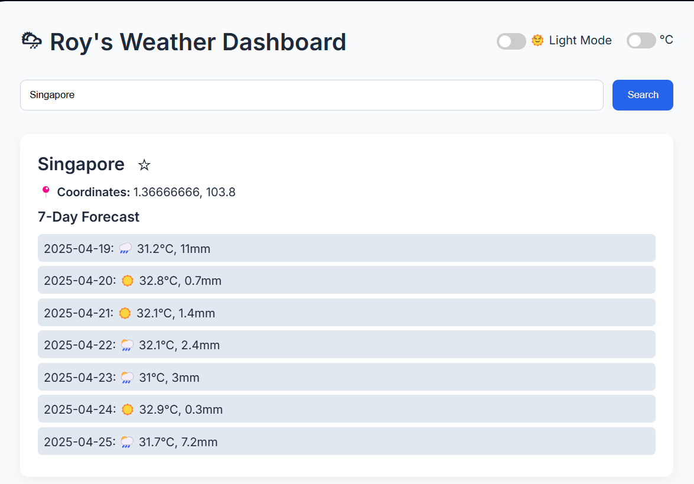

# 🌦 Roy's Weather App

A sleek, full-stack weather dashboard that shows a 7-day forecast by city.  
Built with Node.js, Express, and vanilla JS, with an emphasis on UI polish, dark/light theming, chart visualization, and localStorage-powered personalization.

---

## 🚀 Features

- 🔍 City search with Open-Meteo weather forecast
- 📈 Interactive Chart.js graph of max daily temps
- 🌡️ Toggle between Celsius and Fahrenheit
- 🌗 Dark/light mode support
- ⭐ Favorite cities saved via localStorage
- 📌 Search history with quick click-to-load
- 🌤️ Smart weather icons based on conditions
- ⏳ Loading spinner for better UX
- 💅 Clean, responsive UI with custom styling

---

## 💻 Tech Stack

- **Frontend**: HTML, CSS (custom), JavaScript (vanilla), Chart.js
- **Backend**: Node.js + Express.js
- **APIs**: 
  - [Open-Meteo Weather API](https://open-meteo.com/)
  - [RESTCountries API](https://restcountries.com/)

---

## 📸 Screenshots

```html

